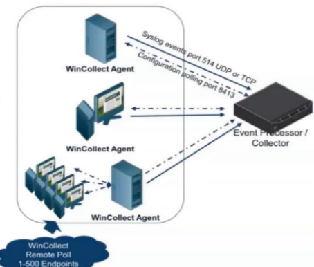

GRIS 2024

NCE UFRJ E POLI UFRJ Rio de Janeiro, 2024

ENTENDENDOUMPOUCOMAISDOBLUE TEAM: SIEM E SOAR

*A better undestand of blue team: SIEM AND SOAR*

FREIRE, Fernanda

**RESUMO:**EstetrabalhoexploraasferramentasdeSIEM(SecurityInformationandEventMa‑ nagement) e SOAR (Security Orchestration, Automation, and Response), que sao cada vez mais utilizadas por empresas corporativas e governamentais para enfrentar ataques ciber‑ neticos. O objetivo e entender como essas ferramentas funcionam e como sao aplicadas na perspectiva do Blue Team, responsavel pela defesa cibernetica. A pesquisa segue um metodo qualitativo, de carater exploratorio, com uma abordagem analı́tico‑descritiva. Espera‑se que

- estudo forneça aos iniciantes uma compreensao mais clara sobre o papel dessas tecnolo‑ gias na defesa cibernetica, bem como ajude o Red Team a entender e explorar as estrategias de defesa do Blue Team para ataques direcionados.

  **Palavras‑chave**: SIEM, SOAR, Cibersegurança, Blue Team, Estrategias Defensivas, Operaçoes de Segurança, Resposta a Incidentes, Detecçao de Ameaças, Automaçao de Segurança

  **ABSTRACT:***ThispaperexploresSIEM(SecurityInformationandEventManagement)andSOAR (Security Orchestration, Automation, and Response) tools, which are increasingly used by cor‑ porate and government organizations to counter cyberattacks. The objective is to gain a better understandingofhowthesetoolsoperateandareappliedfromtheperspectiveoftheBlueTeam, responsible for cybersecurity defense. The research follows a qualitative, exploratory method with an analytical‑descriptive approach. The expected outcome is to provide beginners with a clearer understanding of the role of these technologies in cybersecurity defense, as well as to help the Red Team comprehend and exploit Blue Team defense strategies for targeted attacks.*

  **Keywords**: SIEM, SOAR, Cybersecurity, Blue Team, Defensive Strategies, Security Operations, Incident Response, Threat Detection, Security Automation

FREIRE. Aprofundando conhecimentos no SIEM E SOAR

1 — O que e um SIEM?

O SIEM (Security Information and Event Management) e uma ferramenta essencial para a gestao de segurança da informaçao em ambientes corporativos. De maneira simpli  icada, o SIEM atua como um gerenciador de logs e dados, permitindo o monitoramento centralizado de eventos de segurança provenientes de diversas fontes dentro de uma rede. Isso fornece ao Centro de Operaçoes de Segurança (SOC) uma visao abrangente e consolidada do que esta acontecendo em um ambiente de TI, facilitando a detecçao e resposta a incidentes de segu‑ rança.

1. **— Como recebe os dados?**

Os logs e eventos de segurança chegam ao SIEM a partir de diferentes **log sources** (fontes de logs), que podem incluir servidores, dispositivos de rede, aplicativos, e outros sistemas que geram eventos relevantes para a segurança. Essas fontes de logs sao con  iguradas para en‑ viar dados para o SIEM, geralmente atraves de coletores ou agentes instalados em servidores especı́  icos.

Os **coletores de logs** sao responsaveis por receber e processar eventos de segurança antes de encaminha‑los ao SIEM. Eles sao con  igurados para especi  icar quais tipos de eventos de‑ vem ser coletados, qual o destino desses logs (como o servidor do SIEM), e quais fontes de logsestaosendomonitoradas. EmambientesWindows,essacomunicaçaogeralmenteocorre atraves da porta 514, utilizando tanto os protocolos TCP quanto UDP. O bloqueio dessa porta pode resultar na falha do envio de logs para o SIEM, comprometendo a visibilidade do SOC sobre a rede, ja a porta 8413 e usada para atualizaçoes e con  iguraçoes dos eventos, segue diagrama:

Figura 1: Conexao SIEM com Windows Collector. Credito: IBM

Os eventos de segurança do windows que sao recomendados monitorar de acordo com a Microsoft sao descritos [aqui](https://learn.microsoft.com/en-us/windows-server/identity/ad-ds/plan/appendix-l--events-to-monitor).

Alem da coleta tradicional de logs atraves de agentes e coletores, o SIEM tambem pode rece‑ ber dados via APIs, o que e comum em integraçoes com antivı́rus, sistemas de prevençao de intrusao (IPS), e  irewalls. Essas integraçoes permitem que o SIEM agregue uma ampla gama de dados de segurança, oferecendo uma visao holı́stica do ambiente de TI.

Em ambientes de serviços web, a e  icacia do SIEM (Security Information and Event Mana‑ gement) depende signi  icativamente da integraçao com dispositivos de rede crı́ticos, como   irewalls, proxies e sistemas de prevençao de intrusao (IPS). Isso ocorre porque, em muitos casos, o SIEM nao tem acesso direto aos logs dos servidores onde as tentativas maliciosas podem ocorrer. Esses servidores, frequentemente hospedados em ambientes de nuvem ge‑ renciados por terceiros, podem ter restriçoes em relaçao ao compartilhamento de logs com ferramentas externas.

Nesses casos, para realizar uma monitoraçao mais detalhada e obter acesso aos logs especı́‑   icos dos servidores, pode ser necessario entrar em contato diretamente com o provedor de serviços de nuvem. Eles podem oferecer soluçoes alternativas, como o envio de logs atraves de APIs ou a con  iguraçao de serviços adicionais que permitem a exportaçao dos logs para o SIEM da empresa.

2. **— O que fazer apartir de agora?**

Se voce ja tem o seu siem recebendo eventos e  lows de acordo com os con  igurados, voce ja pode monitorar um ambiente e detectar possiveis ameaças, relacionando diversos compo‑ nentes.

O SIEM e, e deve ser, uma das principais ferramentas de correlaçao de eventos de segurança na atualidade. Essa correlaçao e o ponto chave do SIEM, pois permite que diferentes eventos e dados de varias fontes sejam relacionados, identi  icando padroes que isoladamente pode‑ riam passar despercebidos. Ao correlacionar eventos, o SIEM ajuda a descobrir atividades maliciosas que, sem essa analise integrada, poderiam ser vistas como eventos isolados e ino‑ fensivos.

Embora apenas monitorar os eventos seja um primeiro passo importante, nao e su  iciente para detectar e reagir a ameaças de forma e  icaz. E   necessario con  igurar casos de uso espe‑ cı́  icosqueguiemoSIEMnacorrelaçaodeeventosrelevantesparageraralertassigni  icativos. Existem, inclusive, diversasfontesquejaoferecemcasosdeusoprontosparaseremimporta‑ dos, oquepodefacilitaroprocessoinicialdecon  iguraçao. Noentanto, eimportantelembrar que, alem desses casos prontos, muitos fornecedores de SIEM e segurança tambem oferecem casosdeusopre‑con  iguradosquesaocon  idenciaisefornecemumaproteçaoadicional,sem serem amplamente divulgados.

**1.2.1 Exemplo de correção simples**

A combinaçao de eventos, que individualmente poderiam ser considerados inofensivos ou rotineiros, pode levantar uma bandeira vermelha quando correlacionados. O SIEM pode ge‑ rar um alerta de alta prioridade para que a equipe de segurança investigue essa atividade, prevenindo um possıvel comprometimento do sistema. Um exemplo disso seria o seguinte cenario:

Um logon bem‑sucedido (Event ID 4624) e registrado para uma conta de administrador em

um servidor crı́tico as 3h da manha. Pouco depois, no mesmo servidor, o sistema registra um evento de alteraçao de permissao (Event ID 4670) em um arquivo sensıvel, sugerindo que a conta pode estar sendo usada para modi  icar con  iguraçoes de segurança. Simultaneamente,

- irewalldoservidordetectaebloqueiamultiplastentativasdeconexaoremotaaporta3389, vindas de um endereço IP externo nao autorizado.

  Isoladamente, cada um desses eventos poderia parecer uma açao comum e cotidiana em um ambiente corporativo. O Event ID 4624, por exemplo, indica apenas um logon bem‑sucedido em um sistema Windows, o que pode ocorrer a qualquer momento, dependendo das polı́ti‑ cas da empresa. Alteraçoes em arquivos crı́ticos, como modi  icaçoes em pastas protegidas, tambem podem ser açoes legı́timas realizadas por ferramentas de segurança, como cofres de senha, semindicarnecessariamenteumaameaça. Damesmaforma,tentativasdeconexaode um IP externo nao autorizado, seguidas de bloqueios pelo  irewall, sao eventos corriqueiros e geralmente nao alarmantes.

  No entanto, quando esses eventos ocorrem no mesmo servidor e em um intervalo de tempo curto, o SIEM tem a capacidade de correlaciona‑los e detectar um padrao suspeito. A ocor‑ rencia de um logon administrativo em um horario incomum, seguido de uma alteraçao em arquivos crı́ticos e tentativas de conexao remota bloqueadas, pode indicar que a conta de ad‑ ministrador foi comprometida. O SIEM, ao correlacionar esses eventos aparentemente isola‑ dos, gera um alerta de alta prioridade, destacando um potencial incidente de segurança que poderia passar despercebido sem essa analise integrada.

  2 — O que e um SOAR?

  O SOAR (Security Orchestration, Automation, and Response) e uma ferramenta essencial na gestao de segurança da informaçao, especialmente em ambientes corporativos onde a com‑ plexidade e o volume de incidentes sao altos. De maneira simpli  icada, o SOAR automatiza e orquestra tarefas de segurança, integrando diversos sistemas e ferramentas de segurança para facilitar a detecçao, investigaçao, e resposta a incidentes.

  Com o SOAR, o Centro de Operaçoes de Segurança (SOC) pode automatizar respostas a ame‑ aças, reduzir o tempo de reaçao e melhorar a e  iciencia operacional. Alem disso, o SOAR permite que as equipes de segurança criem  luxos de trabalho personalizados que automa‑ tizam processos repetitivos, possibilitando uma gestao mais agil e e  icaz dos incidentes. Em resumo,oSOARnaoapenascentralizaasoperaçoesdesegurança,mastambemastornamais rapidas e consistentes, aliviando a carga sobre os analistas e permitindo um foco maior em ameaças complexas e estrategicas.

  **2.1 Como é seu funcionamento?**

  **2.1.1 Security Orquestration ‑ Orquestração de segurança**

  OSOdeSOARsurgeapartirdaorquestraçaodesegurança,queepossibilitadapelaintegraçao e automaçao das ferramentas de segurança atraves de APIs. Isso abre a possibilidade para que a propria ferramenta faça alteraçoes nas soluçoes de segurança, como em casos de blo‑ queio. Esse processo ocorre por meio da criaçao de playbooks automatizados, que de  inem as açoes que um analista do SOC tomaria em determinadas situaçoes. A partir das conexoes via API, a ferramenta segue esses passos automaticamente.

  Um caso exemplo seria, de acordo com a IBM:

”Um analista de segurança que investiga um e‑mail de phishing pode precisar de um gateway de e‑mail seguro, uma plataforma de inteligencia de ameaças e um software antivı́rus para identi  icar, entender e resolver a ameaça. Essas fer‑ ramentas geralmente vem de fornecedores diferentes e podem nao se integrar prontamente; portanto, os analistas devem se mover manualmente entre as fer‑ ramentas enquanto trabalham. Com um SOAR, os SOCs podem uni  icar essas fer‑ ramentas em  luxos de trabalho de operaçoes de segurança (SecOps) coerentes e repetı́veis”. (IBM, 2023)

Nesse caso, o playbook poderia ser assionado e ter feito o trabalho do analista de alterar as ferramentas, ja entregando as saidas em apenas uma tela.

Janotamosnocasoacimaaaplicaçaodaautomaçao,poremalemdisso,eletambemecapazde abrir e fechar tickets em ferramentas de gerenciamento de tickets tambem com a utilizaçao de playbooks.

Um caso exemplo seria, de acordo com a IBM:

”Porexemplo, imagine como umaplataformaSOARpodeautomatizaruma inves‑ tigaçaodeumnotebookcomprometido. Aprimeiraindicaçaodequealgoestaer‑ rado vem de uma soluçao de detecçao e resposta de endpoint (EDR), que detecta atividades suspeitas no notebook. O EDR envia um alerta ao SOAR, que aciona

- SOAR para executar um playbook prede  inido. Primeiro, o SOAR abre um tic‑ ket para o incidente. Ele enriquece o alerta com dados de feeds integrados de inteligencia de ameaças e outras ferramentas de segurança. Em seguida, o SOAR executa respostas automatizadas, como acionar uma ferramenta de detecçao e resposta de rede (NDR) para colocar o endpoint em quarentena ou solicitar que
- software antivı́rus encontre e detone o malware. Por  im, o SOAR passa o ticket para um analista de segurança, que determina se o incidente foi resolvido ou se e necessaria intervençao humana.”. (IBM, 2023)

Como observado, a resposta de incidentes se torna mais pratica e tambem mais tunelada de falsos positivos encontrados. o SOAR torna o SOC ainda mais assertivo e facilita a visao do mesmosemanecessidadedemutiplasferramentasabertasparaaresoluçaodeumincidente.

3 SIEM vs SOAR

Vale ressaltar que ambos tem objetivos diferentes. O SIEM tem como objetivo relacionar eventos e gerar alertas a partir de suas correlaçoes, ja o SOAR considera a automaçao de work  lows, diminuindo a necessidade de açoes manuais.

Alem disso, o SIEM pode receber logs de segurança de todos os dispositivos conectados na rede, sejam eles dispositivos de segurança ou nao. Ja o SOAR e focado em dispositivos de segurança a qual o permite realizar a conexao via API, e realizar açoes automatizadas via playbooks.

Enquantoumefocadonadescobertadenovasvulnerabilidadesoupossibilidadesdeataques,

- outro se concentra na tratativa aprimorada desses casos. Considerando isso, e possivel dizer que o melhor cenario nunca sera ter um ou o outro mas sim a integraçao entre os dois casos, aumentando o nivel de segurança da empresa.

  4 — Conclusoes

  Em um cenario onde as ameaças ciberneticas estao em constante evoluçao, as ferramentas de SIEM e SOAR desempenham papeis complementares e essenciais para a segurança da in‑ formaçao. O SIEM, com sua capacidade de correlaçao e analise de eventos, fornece uma visao abrangentedoambientedeTI,permitindoadetecçaoprecocedepotenciaisameaças. Porou‑ tro lado, o SOAR nao apenas automatiza e orquestra a resposta a esses eventos, mas tambem permite que as equipes de segurança reduzam o tempo de resposta e aprimorem a e  iciencia operacional.

  Aocombinar as capacidades analı́ticasdo SIEM com a automaçao e orquestraçao do SOAR,as organizaçoes podem criar uma defesa cibernetica robusta e e  iciente. Essa integraçao per‑ mite que os SOCs nao apenas identi  iquem e respondam rapidamente a incidentes, mas tam‑ bem otimizem seus  luxos de trabalho, minimizando a carga manual sobre os analistas e re‑ duzindo a possibilidade de erros humanos.

  Portanto, em vez de escolher entre SIEM e SOAR, a abordagem mais e  icaz e utilizar ambos em conjunto. Isso oferece uma soluçao de segurança mais completa, onde a detecçao rapida de ameaças e seguida por uma resposta agil e automatizada, garantindo a proteçao contı́nua e e  icaz do ambiente corporativo. Este estudo destaca a importancia dessa integraçao, for‑ necendo uma compreensao clara de como essas tecnologias se complementam e se reforçam mutuamente na defesa contra ataques ciberneticos.

  Referencias

  Stellar Cyber. *SIEM vs. SOAR: What’s the Difference?*. Disponıvel em: [<https://stellarcyber. ai/learn/siem‑vs‑soar/>](https://stellarcyber.ai/learn/siem-vs-soar/).

  IBM. *QRadar SOAR*. Disponıvel em: [<https://www.ibm.com/br‑pt/products/qradar‑soar>](https://www.ibm.com/br-pt/products/qradar-soar).

  IBM. *Deploying managed QRadar WinCollect agents: QRadar WinCollect Troubleshooting Open Mic*. Disponıvel em: [<https://learn.ibm.com/mod/url/view.php?id=283628& forceview=1>](https://learn.ibm.com/mod/url/view.php?id=283628&forceview=1).

  IBM. *Deploying QRadar WinCollect*. Disponıvel em: [<https://learn.ibm.com/mod/hvp/view. php?id=283627#collapse2>](https://learn.ibm.com/mod/hvp/view.php?id=283627#collapse2).

  IBM. *O que é SOAR (orquestração de segurança, automação e resposta)?*. Disponıvel em: [<https://www.ibm.com/br‑pt/topics/security‑orchestration‑automation‑response>](https://www.ibm.com/br-pt/topics/security-orchestration-automation-response). IBM, 2023.

  Microsoft. *Appendix L: Events to Monitor*. Disponıvel em: [<https://learn.microsoft.com/ en‑us/windows‑server/identity/ad‑ds/plan/appendix‑l‑‑events‑to‑monitor>](https://learn.microsoft.com/en-us/windows-server/identity/ad-ds/plan/appendix-l--events-to-monitor).

  . . . . . . . . . . . . . . . . .
Grupo de Respostas a Incidentes de Segurança ‑ 2024 UFRJ 2024
