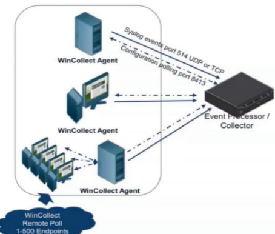

# GRIS 2024

**NCE UFRJ E POLI UFRJ**  
Rio de Janeiro, 2024

## ENTENDENDO UM POUCO MAIS DO BLUE TEAM: SIEM E SOAR

*A Better Understanding of the Blue Team: SIEM AND SOAR*

**FREIRE, Fernanda**

### RESUMO

Este trabalho explora as ferramentas de SIEM (Security Information and Event Management) e SOAR (Security Orchestration, Automation, and Response), que são cada vez mais utilizadas por empresas corporativas e governamentais para enfrentar ataques cibernéticos. O objetivo é entender como essas ferramentas funcionam e como são aplicadas na perspectiva do Blue Team, responsável pela defesa cibernética. A pesquisa segue um método qualitativo, de caráter exploratório, com uma abordagem analítico-descritiva. Espera-se que o estudo forneça aos iniciantes uma compreensão mais clara sobre o papel dessas tecnologias na defesa cibernética, bem como ajude o Red Team a entender e explorar as estratégias de defesa do Blue Team para ataques direcionados.

**Palavras‑chave:** SIEM, SOAR, Cibersegurança, Blue Team, Estratégias Defensivas, Operações de Segurança, Resposta a Incidentes, Detecção de Ameaças, Automação de Segurança

### ABSTRACT

*This paper explores SIEM (Security Information and Event Management) and SOAR (Security Orchestration, Automation, and Response) tools, which are increasingly used by corporate and government organizations to counter cyberattacks. The objective is to gain a better understanding of how these tools operate and are applied from the perspective of the Blue Team, responsible for cybersecurity defense. The research follows a qualitative, exploratory method with an analytical-descriptive approach. The expected outcome is to provide beginners with a clearer understanding of the role of these technologies in cybersecurity defense, as well as to help the Red Team comprehend and exploit Blue Team defense strategies for targeted attacks.*

**Keywords:** SIEM, SOAR, Cybersecurity, Blue Team, Defensive Strategies, Security Operations, Incident Response, Threat Detection, Security Automation

---

## 1 — O que é um SIEM?

O SIEM (Security Information and Event Management) é uma ferramenta essencial para a gestão de segurança da informação em ambientes corporativos. De maneira simplificada, o SIEM atua como um gerenciador de logs e dados, permitindo o monitoramento centralizado de eventos de segurança provenientes de diversas fontes dentro de uma rede. Isso fornece ao Centro de Operações de Segurança (SOC) uma visão abrangente e consolidada do que está acontecendo em um ambiente de TI, facilitando a detecção e resposta a incidentes de segurança.

### 1.1 — Como recebe os dados?

Os logs e eventos de segurança chegam ao SIEM a partir de diferentes **log sources** (fontes de logs), que podem incluir servidores, dispositivos de rede, aplicativos, e outros sistemas que geram eventos relevantes para a segurança. Essas fontes de logs são configuradas para enviar dados para o SIEM, geralmente através de coletores ou agentes instalados em servidores específicos.

Os **coletores de logs** são responsáveis por receber e processar eventos de segurança antes de encaminhá-los ao SIEM. Eles são configurados para especificar quais tipos de eventos devem ser coletados, qual o destino desses logs (como o servidor do SIEM), e quais fontes de logs estão sendo monitoradas. Em ambientes Windows, essa comunicação geralmente ocorre através da porta 514, utilizando tanto os protocolos TCP quanto UDP. O bloqueio dessa porta pode resultar na falha do envio de logs para o SIEM, comprometendo a visibilidade do SOC sobre a rede, já a porta 8413 é usada para atualizações e configurações dos eventos, segue diagrama:

**Figura 1: Conexão SIEM com Windows Collector. Crédito: IBM**

Os eventos de segurança do Windows que são recomendados monitorar de acordo com a Microsoft são descritos [aqui](https://learn.microsoft.com/en-us/windows-server/identity/ad-ds/plan/appendix-l--events-to-monitor).

Além da coleta tradicional de logs através de agentes e coletores, o SIEM também pode receber dados via APIs, o que é comum em integrações com antivírus, sistemas de prevenção de intrusão (IPS), e firewalls. Essas integrações permitem que o SIEM agregue uma ampla gama de dados de segurança, oferecendo uma visão holística do ambiente de TI.

Em ambientes de serviços web, a eficácia do SIEM (Security Information and Event Management) depende significativamente da integração com dispositivos de rede críticos, como firewalls, proxies e sistemas de prevenção de intrusão (IPS). Isso ocorre porque, em muitos casos, o SIEM não tem acesso direto aos logs dos servidores onde as tentativas maliciosas podem ocorrer. Esses servidores, frequentemente hospedados em ambientes de nuvem gerenciados por terceiros, podem ter restrições em relação ao compartilhamento de logs com ferramentas externas.

Nesses casos, para realizar uma monitoração mais detalhada e obter acesso aos logs específicos dos servidores, pode ser necessário entrar em contato diretamente com o provedor de serviços de nuvem. Eles podem oferecer soluções alternativas, como o envio de logs através de APIs ou a configuração de serviços adicionais que permitem a exportação dos logs para o SIEM da empresa.

### 2 — O que fazer a partir de agora?

Se você já tem o seu SIEM recebendo eventos e fluxos de acordo com o configurado, você já pode monitorar um ambiente e detectar possíveis ameaças, relacionando diversos componentes.

O SIEM é, e deve ser, uma das principais ferramentas de correlação de eventos de segurança na atualidade. Essa correlação é o ponto chave do SIEM, pois permite que diferentes eventos e dados de várias fontes sejam relacionados, identificando padrões que isoladamente poderiam passar despercebidos. Ao correlacionar eventos, o SIEM ajuda a descobrir atividades maliciosas que, sem essa análise integrada, poderiam ser vistas como eventos isolados e inofensivos.

Embora apenas monitorar os eventos seja um primeiro passo importante, não é suficiente para detectar e reagir a ameaças de forma eficaz. É necessário configurar casos de uso específicos que guiem o SIEM na correlação de eventos relevantes para gerar alertas significativos. Existem, inclusive, diversas fontes que já oferecem casos de uso prontos para serem importados, o que pode facilitar o processo inicial de configuração. No entanto, é importante lembrar que, além desses casos prontos, muitos fornecedores de SIEM e segurança também oferecem casos de uso pré-configurados que são confidenciais e fornecem uma proteção adicional, sem serem amplamente divulgados.

#### 2.1 Exemplo de correção simples

A combinação de eventos, que individualmente poderiam ser considerados inofensivos ou rotineiros, pode levantar uma bandeira vermelha quando correlacionados. O SIEM pode gerar um alerta de alta prioridade para que a equipe de segurança investigue essa atividade, prevenindo um possível comprometimento do sistema. Um exemplo disso seria o seguinte cenário:

Um logon bem-sucedido (Event ID 4624) é registrado para uma conta de administrador em um servidor crítico às 3h da manhã. Pouco depois, no mesmo servidor, o sistema registra um evento de alteração de permissão (Event ID 4670) em um arquivo sensível, sugerindo que a conta pode estar sendo usada para modificar configurações de segurança. Simultaneamente, o firewall do servidor detecta e bloqueia múltiplas tentativas de conexão remota à porta 3389, vindas de um endereço IP externo não autorizado.

Isoladamente, cada um desses eventos poderia parecer uma ação comum e cotidiana em um ambiente corporativo. O Event ID 4624, por exemplo, indica apenas um logon bem-sucedido em um sistema Windows, o que pode ocorrer a qualquer momento, dependendo das políticas da empresa. Alterações em arquivos críticos, como modificações em pastas protegidas, também podem ser ações legítimas realizadas por ferramentas de segurança, como cofres de senha, sem indicar necessariamente uma ameaça. Da mesma forma, tentativas de conexão de um IP externo não autorizado, seguidas de bloqueios pelo firewall, são eventos corriqueiros e geralmente não alarmantes.

No entanto, quando esses eventos ocorrem no mesmo servidor e em um intervalo de tempo curto, o SIEM tem a capacidade de correlacioná-los e detectar um padrão suspeito. A ocorrência de um logon administrativo em um horário incomum, seguido de uma alteração em arquivos críticos e tentativas de conexão remota bloqueadas, pode indicar que a conta de administrador foi comprometida. O SIEM, ao correlacionar esses eventos aparentemente isolados, gera um alerta de alta prioridade, destacando um potencial incidente de segurança que poderia passar despercebido sem essa análise integrada.

### 3 — O que é um SOAR?

O SOAR (Security Orchestration, Automation, and Response) é uma ferramenta essencial na gestão de segurança da informação, especialmente em ambientes corporativos onde a complexidade e o volume de incidentes são altos. De maneira simplificada, o SOAR automatiza e orquestra tarefas de segurança, integrando diversos sistemas e ferramentas de segurança para facilitar a detecção, investigação e resposta a incidentes.

Com o SOAR, o Centro de Operações de Segurança (SOC) pode automatizar respostas a ameaças, reduzir o tempo de reação e melhorar a eficiência operacional. Além disso, o SOAR permite que as equipes de segurança criem fluxos de trabalho personalizados que automatizam processos repetitivos, possibilitando uma gestão mais ágil e eficaz dos incidentes. Em resumo, o SOAR não apenas centraliza as operações de segurança, mas também as torna mais rápidas e consistentes, aliviando a carga sobre os analistas e permitindo um foco maior em ameaças complexas e estratégicas.

#### 3.1 Como é seu funcionamento?

##### 3.1.1 Security Orchestration - Orquestração de segurança

O SO de SOAR surge a partir da orquestração de segurança, que é possibilitada pela integração e automação das ferramentas de segurança através de APIs. Isso abre a possibilidade para que a própria ferramenta faça alterações nas soluções de segurança, como em casos de bloqueio. Esse processo ocorre por meio da criação de playbooks automatizados, que definem as ações que um analista do SOC tomaria em determinadas situações. A partir das conexões via API, a ferramenta segue esses passos automaticamente.

Um caso exemplo seria, de acordo com a IBM:

> "Um analista de segurança que investiga um e-mail de phishing pode precisar de um gateway de e-mail seguro, uma plataforma de inteligência de ameaças e um software antivírus para identificar, entender e resolver a ameaça. Essas ferramentas geralmente vêm de fornecedores diferentes e podem não se integrar prontamente; portanto, os analistas devem se mover manualmente entre as ferramentas enquanto trabalham. Com um SOAR, os SOCs podem unificar essas ferramentas em fluxos de trabalho de operações de segurança (SecOps) coerentes e repetíveis". (IBM, 2023)

Nesse caso, o playbook poderia ser acionado e ter feito o trabalho do analista de alterar as ferramentas, já entregando os resultados em apenas uma tela.

Já notamos no caso acima a aplicação da automação, porém, além disso, ele também é capaz de abrir e fechar tickets em ferramentas de gerenciamento de tickets também com a utilização de playbooks.

Um caso exemplo seria, de acordo com a IBM:

> "Por exemplo, imagine como uma plataforma SOAR pode automatizar uma investigação de um notebook comprometido. A primeira indicação de que algo está errado vem de uma solução de detecção e resposta de endpoint (EDR), que detecta atividades suspeitas no notebook. O EDR envia um alerta ao SOAR, que aciona o SOAR para executar um playbook predefinido. Primeiro, o SOAR abre um ticket para o incidente. Ele enriquece o alerta com dados de feeds integrados de inteligência de ameaças e outras ferramentas de segurança. Em seguida, o SOAR executa respostas automatizadas, como acionar uma ferramenta de detecção e resposta de rede (NDR) para colocar o endpoint em quarentena ou solicitar que o software antivírus encontre e detone o malware. Por fim, o SOAR passa o ticket para um analista de segurança, que determina se o incidente foi resolvido ou se é necessária intervenção humana.". (IBM, 2023)

Como observado, a resposta de incidentes se torna mais prática e também mais refinada, reduzindo a ocorrência de falsos positivos. O SOAR torna o SOC ainda mais assertivo e facilita a visão do mesmo, sem a necessidade de múltiplas ferramentas abertas para a resolução de um incidente.

### 4 — SIEM vs SOAR

Vale ressaltar que ambos têm objetivos diferentes. O SIEM tem como objetivo relacionar eventos e gerar alertas a partir de suas correlações, enquanto o SOAR considera a automação de workflows, reduzindo a necessidade de ações manuais.

Além disso, o SIEM pode receber logs de segurança de todos os dispositivos conectados na rede, sejam eles dispositivos de segurança ou não. Já o SOAR é focado em dispositivos de segurança, os quais permite realizar a conexão via API, e realizar ações automatizadas via playbooks.

Enquanto um é focado na descoberta de novas vulnerabilidades ou possibilidades de ataques, o outro se concentra na tratativa aprimorada desses casos. Considerando isso, é possível dizer que o melhor cenário nunca será ter um ou o outro, mas sim a integração entre os dois, aumentando o nível de segurança da empresa.

### 5 — O Futuro do SIEM e SOAR

À medida que as ameaças cibernéticas continuam a evoluir, o papel do SIEM e do SOAR também evoluirá. A integração de IA e machine learning promete transformar ainda mais essas ferramentas, tornando-as mais proativas e autônomas. Em vez de apenas reagir a incidentes, futuras implementações poderão prever ataques e tomar medidas preventivas antes que o dano seja causado.

#### 5.1 SIEM e SOAR Baseados em Nuvem

Com a crescente adoção de arquiteturas de nuvem, tanto o SIEM quanto o SOAR estão migrando para ambientes de nuvem. Isso não só facilita a escalabilidade como também permite uma melhor integração com outros serviços em nuvem. No entanto, essa mudança traz novos desafios em termos de segurança e privacidade, que precisam ser cuidadosamente gerenciados.

#### 5.2 A Convergência de SIEM e SOAR

Outra tendência importante é a convergência de SIEM e SOAR em plataformas unificadas, como o Cortex XSIAM ou o Next-Gen SIEM. Essa convergência permite uma abordagem mais coesa para a segurança cibernética, onde a detecção, resposta, automação e inteligência artificial trabalham juntas em um único sistema. Isso não apenas simplifica a gestão da segurança como também melhora a eficácia das operações de segurança.

#### 5.3 Adoção de Inteligência Artificial e Machine Learning

A IA e o machine learning estão sendo cada vez mais integrados em soluções de SIEM e SOAR para melhorar a detecção de ameaças e a resposta automatizada. Esses avanços permitem que as ferramentas identifiquem padrões e anomalias que poderiam passar despercebidos por sistemas tradicionais, além de ajustar automaticamente as estratégias de defesa com base em novas informações.

### 6 — Conclusões

Em um cenário onde as ameaças cibernéticas estão em constante evolução, as ferramentas de SIEM e SOAR desempenham papéis complementares e essenciais para a segurança da informação. O SIEM, com sua capacidade de correlação e análise de eventos, fornece uma visão abrangente do ambiente de TI, permitindo a detecção precoce de potenciais ameaças. Por outro lado, o SOAR não apenas automatiza e orquestra a resposta a esses eventos, mas também permite que as equipes de segurança reduzam o tempo de resposta e aprimorem a eficiência operacional.

Ao combinar as capacidades analíticas do SIEM com a automação e orquestração do SOAR, as organizações podem criar uma defesa cibernética robusta e eficiente. Essa integração permite que os SOCs não apenas identifiquem e respondam rapidamente a incidentes, mas também otimizem seus fluxos de trabalho, minimizando a carga manual sobre os analistas e reduzindo a possibilidade de erros humanos.

Portanto, em vez de escolher entre SIEM e SOAR, a abordagem mais eficaz é utilizar ambos em conjunto. Isso oferece uma solução de segurança mais completa, onde a detecção rápida de ameaças é seguida por uma resposta ágil e automatizada, garantindo a proteção contínua e eficaz do ambiente corporativo. Este estudo destaca a importância dessa integração, fornecendo uma compreensão clara de como essas tecnologias se complementam e se reforçam mutuamente na defesa contra ataques cibernéticos.

### Referências

- Stellar Cyber. *SIEM vs. SOAR: What’s the Difference?*. Disponível em: [https://stellarcyber.ai/learn/siem-vs-soar/](https://stellarcyber.ai/learn/siem-vs-soar/).
- IBM. *QRadar SOAR*. Disponível em: [https://www.ibm.com/br-pt/products/qradar-soar](https://www.ibm.com/br-pt/products/qradar-soar).
- IBM. *Deploying managed QRadar WinCollect agents: QRadar WinCollect Troubleshooting Open Mic*. Disponível em: [https://learn.ibm.com/mod/url/view.php?id=283628&forceview=1](https://learn.ibm.com/mod/url/view.php?id=283628&forceview=1).
- IBM. *Deploying QRadar WinCollect*. Disponível em: [https://learn.ibm.com/mod/hvp/view.php?id=283627#collapse2](https://learn.ibm.com/mod/hvp/view.php?id=283627#collapse2).
- IBM. *O que é SOAR (orquestração de segurança, automação e resposta)?*. Disponível em: [https://www.ibm.com/br-pt/topics/security-orchestration-automation-response](https://www.ibm.com/br-pt/topics/security-orchestration-automation-response). IBM, 2023.
- Microsoft. *Appendix L: Events to Monitor*. Disponível em: [https://learn.microsoft.com/en-us/windows-server/identity/ad-ds/plan/appendix-l--events-to-monitor](https://learn.microsoft.com/en-us/windows-server/identity/ad-ds/plan/appendix-l--events-to-monitor).

---

**Grupo de Respostas a Incidentes de Segurança - 2024 UFRJ 2024**
